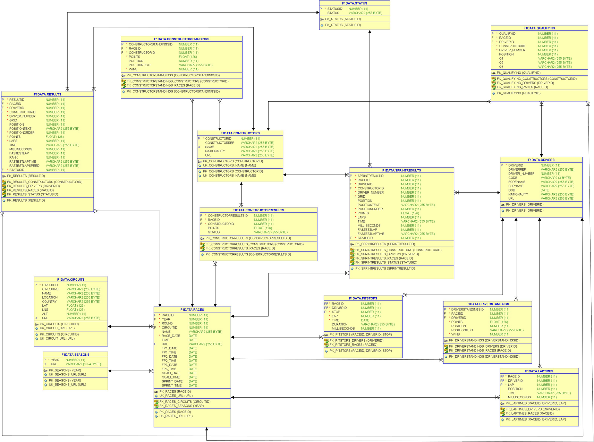

# Gitpod Workspace with Oracle Database 23c Free and F1data schema for Modern Oracle Database Programming

This repo is a fork from the original source code repository prepared by Alex and Patrick. It has been extended with a Gitpod Workspace definition that includes an Oracle Database 23c Free instance that is setup with the F1data schema used by Alex and Patrick for the examples in their book. Once this workspace is running, you have access to a running database with the f1data schema including all tables and other database objects as well as the data.

You can run the Gitpod workspace by clicking this button:

[](https://gitpod.io/#https://github.com/lucasjellema/modern-oracle-database-programming/tree/gitpod-workspace-23c-free)

SQLcl command line tool (see [SQLcl introduction](https://www.oracle.com/database/sqldeveloper/technologies/sqlcl/) for details) is installed in the workspace and can be accessed using:

```
alias sql="/workspace/modern-oracle-database-programming/sqlcl/bin/sql"
sql f1data/"Formula1Database!"@localhost:1521/FREEPDB1 
```  

The table schema that user *f1data* has when the workspace is up and running - taken from the front matter in Alex's and Patrick's book - is shown here:



## Steps in Starting Gitpod Workspace

The stages the workspace goes through when it is starting up are (note: this happens automatically, you can just sit back and relax for 5-8 minutes):
1. Download (Pull) Oracle Database 23c Free container image  
2. Run Oracle Database 23c Free container 
3. Download/install SQLcl
4. Connect to database as SYS and create user f1data


5. Grant privileges to user f1data 
6. Create tables, comments, package & function, 
7. Grants and Synonyms


8. Create Database Directory Object on /tmp/f1data inside the container and grant directory to user f1data
9. Create External Table and insert data from csv files into the f1data tables - more than 500K records (especially laptimes!)


Once the steps are complete, you can explore the database objects through the VS Code addin Oracle Explorer:


## Work against Oracle Database 23c Free from your local SQL Developer

Many of us like to work with a GUI – especially the free SQL Developer tool that over the years we have come to embrace. I will show how to work with a locally installed SQL Developer environment – running on your laptop – against this cloud based Oracle Database 23c Free instance in a Gitpod workspace. The final setup will look like this:


First – make sure you have got SQL Developer up and running on your local environment (starting from the SQL Developer downloads page if you do not yet have it). You also need to have VS Code on your local environment; this will be the conduit for the SSH connection over which SQL Developer will communicate with the database in the remote Workspace.

you need to bring the remote workspace to your laptop. Or rather: you create an SSH connecti0n through your local VS Code that will forward any local communication with port 1521 to the remote workspace. The steps to make this happen:

1. Open the Command Palette in the Gitpod Workspace (on my Windows machine I do this using CTRL SHIFT P ) and select "Gitpod: Open in VS Code".


Alternatively, click on the "hamburger" icon and click on the menu item *Gitpod: Open in VS Code*


2. Accept the browser popup that notifies you of opening Visual Studio Code from the browser:


3. Click on Open when Visual Studio Code prompt you to "Allow an extension to open this URI?"


4. Click on Copy to save the temporary password for the SSH connection to the clipboard:


5. When this popup appears:


paste the password from the clipboard to the field and press enter:


6. VS Code now opens and shows the same files and the same terminals as you saw before in the browser based VS Code environment:


Open the ports tab


Here you can see the "magic" to connect the local port 1521 to the port 1521 exposed in the remote Gitpod workspace. Any attempt to access localhost:1521 on your laptop is now intercepted by VS Code and forwarded over the SSH connection to the Gitpod workspace. I think that is brilliant!

7. Time now to open SQL Developer


8. When it has started, you can define a new database connection – click on the plus icon and select New Database Connection


Then provide the connection details:
* username: f1data
* password: Formula1Database!
* Hostname: localhost
* Port: 1521
* Service Name: FREEPDB1

For convenience sake, you can check the box for Save Password.


Click on Test to verify these connection details:


It is not spectacular in a visual way but the Status: Success message is reassuring. Now click Connect.

9. At this point, SQL Developer is connected to the *f1data* schema in the FREEPDB1 database running in your cloud based Gitpod workspace. And you can work against it just like you work with any Oracle Database 23c Free instance running anywhere.


Here you see a telltale sign for 23c: select sysdate – at long last without including "FROM DUAL".


## Note: Actual Formula 1 Data

Note: actual data regarding Formula 1 results is downloaded from http://ergast.com/downloads/f1db_csv.zip . This zip-file is refreshed frequently with the latest results. There is a risk that a future version of that file will not have the exact same structure as the data import routines in file F1Data_Import_csv.sql expect - or that this file for whatever reason is no longer available. To prepare for that eventuality, a copy taken on 14th April 2023 is stored in directory *historical_data*. In case the file cannot be retrieved successfully from http://ergast.com/downloads, you can use this file as an alternative. 

In that case, you will have to create a new terminal window and execute these steps:
```
cp /workspace/modern-oracle-database-programming/historical-data/f1db_csv-as-of-20230414.zip /workspace/modern-oracle-database-programming/f1data/f1db_csv.zip
# proceed with the regular code:
unzip -q f1db_csv.zip
# all csv data files are now in directory /workspace/modern-oracle-database-programming/f1data - ready to be used in external table definitions inside the container
cd ..
# copy csv files into the container - make them available at /f1data inside the container
docker cp f1data/. 23cfree:/f1data &&
# copy directory f1data to /tmp and make writable - as required for Oracle external tables 
echo "cp -r /f1data /tmp && chmod +777 /tmp/f1data" > copyToTmpCommand && chmod +777 copyToTmpCommand && docker cp copyToTmpCommand 23cfree:/tmp && docker exec -it 23cfree bash /tmp/copyToTmpCommand
# create a directory f1_csv_dir to connect from database to local directory /tmp/f1data (inside container)
# create one external table file_ext using the directory f1_csv_dir to retrieve data from csv files and insert into tables in f1data schema Note: this step can take several minutes - it processes several 100Ks of records
gp sync-await database-started &&
/workspace/modern-oracle-database-programming/sqlcl/bin/sql sys/"TheSuperSecret1509!"@localhost:1521/FREEPDB1 as sysdba @"F1Data_Create_Directory.sql" && 
/workspace/modern-oracle-database-programming/sqlcl/bin/sql f1data/"Formula1Database!"@localhost:1521/FREEPDB1 @"F1Data_Import_csv.sql"
```


# Apress Source Code

This repository accompanies [Modern Oracle Database Programming: Level Up Your Skill Set to Oracle's Latest and Most Powerful Features in SQL, PL/SQL, and JSON ](https://www.link.springer.com/book/10.1007/9781484291658) by Alex Nuijten and Patrick Barel (Apress, 2023).

[comment]: #cover


Download the files as a zip using the green button, or clone the repository to your machine using Git.

## Releases

Release v1.0 corresponds to the code in the published book, without corrections or updates.

## Contributions

See the file Contributing.md for more information on how you can contribute to this repository.