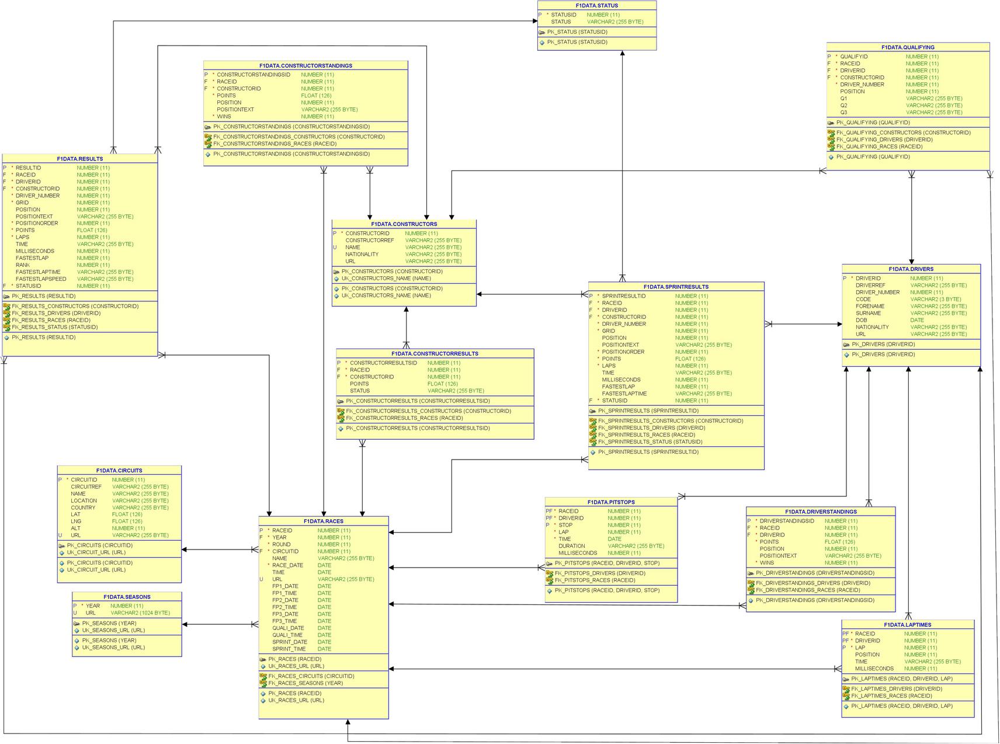

# Gitpod Workspace with Oracle Database 23c Free and F1data schema for Modern Oracle Database Programming: Level Up Your Skill Set to Oracle's Latest and Most Powerful Features in SQL, PL/SQL, and JSON by Alex Nuijten and Patrick Barel (Apress, 2023).

This repo is a fork from the original source code repository prepared by Alex and Patrick. It has been extended with a Gitpod Workspace definition that includes an Oracle Database 23c Free instance that is setup with the F1data schema used by Alex and Patrick for the examples in their book. Once this workspace is running, you have access to a running database with the f1data schema including all tables and other database objects as well as the data.

You can run the Gitpod workspace by clicking this button:
[](https://gitpod.io/#https://github.com/lucasjellema/modern-oracle-database-programming/tree/gitpod-workspace-23c-free)


You can use the VS Code Oracle Developer Tools extension for VS Code - which is preconfigured with a database connection for the f1data account.

SQLcl command line tool (see [SQLcl introduction](https://www.oracle.com/database/sqldeveloper/technologies/sqlcl/) for details) has also been installed and can be accessed using:

```
alias sql="/workspace/modern-oracle-database-programming/sqlcl/bin/sql"
sql f1data/"Formula1Database!"@localhost:1521/FREEPDB1 
```  

The table schema that user *f1data* has when the workspace is up and running - taken from the front matter in Alex's and Patrick's book - is shown here:



Note: actual data regarding Formula 1 results is downloaded from http://ergast.com/downloads/f1db_csv.zip . This zip-file is refreshed frequently with the latest results. There is a risk that a future version of that file will not have the exact same structure as the data import routines in file F1Data_Import_csv.sql expect - or that this file for whatever reason is no longer available. To prepare for that eventuality, a copy taken on 14th April 2023 is stored in directory *historical_data*. In case the file cannot be retrieved successfully from http://ergast.com/downloads, you can use this file as an alternative. 

In that case, you will have to create a new terminal window and execute these steps:
```
cp /workspace/modern-oracle-database-programming/historical-data/f1db_csv-as-of-20230414.zip /workspace/modern-oracle-database-programming/f1data/f1db_csv.zip
# proceed with the regular code:
unzip -q f1db_csv.zip
# all csv data files are now in directory /workspace/modern-oracle-database-programming/f1data - ready to be used in external table definitions inside the container
cd ..
# copy csv files into the container - make them available at /f1data inside the container
docker cp f1data/. 23cfree:/f1data &&
# copy directory f1data to /tmp and make writable - as required for Oracle external tables 
echo "cp -r /f1data /tmp && chmod +777 /tmp/f1data" > copyToTmpCommand && chmod +777 copyToTmpCommand && docker cp copyToTmpCommand 23cfree:/tmp && docker exec -it 23cfree bash /tmp/copyToTmpCommand
# create a directory f1_csv_dir to connect from database to local directory /tmp/f1data (inside container)
# create one external table file_ext using the directory f1_csv_dir to retrieve data from csv files and insert into tables in f1data schema Note: this step can take several minutes - it processes several 100Ks of records
gp sync-await database-started &&
/workspace/modern-oracle-database-programming/sqlcl/bin/sql sys/"TheSuperSecret1509!"@localhost:1521/FREEPDB1 as sysdba @"F1Data_Create_Directory.sql" && 
/workspace/modern-oracle-database-programming/sqlcl/bin/sql f1data/"Formula1Database!"@localhost:1521/FREEPDB1 @"F1Data_Import_csv.sql"


# Apress Source Code

This repository accompanies [Modern Oracle Database Programming: Level Up Your Skill Set to Oracle's Latest and Most Powerful Features in SQL, PL/SQL, and JSON ](https://www.link.springer.com/book/10.1007/9781484291658) by Alex Nuijten and Patrick Barel (Apress, 2023).

[comment]: #cover


Download the files as a zip using the green button, or clone the repository to your machine using Git.

## Releases

Release v1.0 corresponds to the code in the published book, without corrections or updates.

## Contributions

See the file Contributing.md for more information on how you can contribute to this repository.