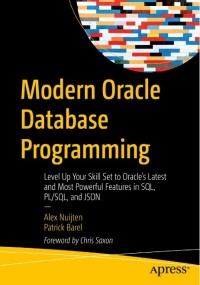

# Apress Source Code

This repository accompanies [Modern Oracle Database Programming: Level Up Your Skill Set to Oracle's Latest and Most Powerful Features in SQL, PL/SQL, and JSON ](https://www.link.springer.com/book/10.1007/9781484291658) by Alex Nuijten and Patrick Barel (Apress, 2023).

[comment]: #cover

Download the files as a zip using the green button, or clone the repository to your machine using Git.

## Releases

Release v1.0 corresponds to the code in the published book, without corrections or updates.

## Contributions

See the file Contributing.md for more information on how you can contribute to this repository.